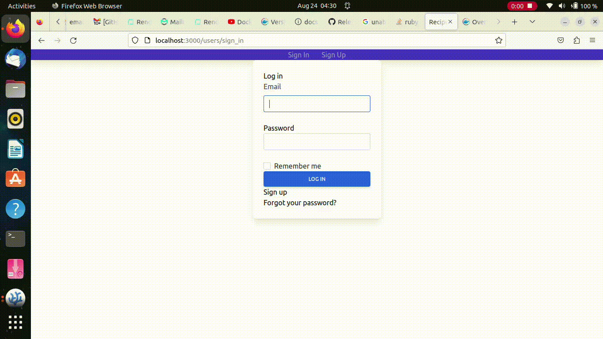
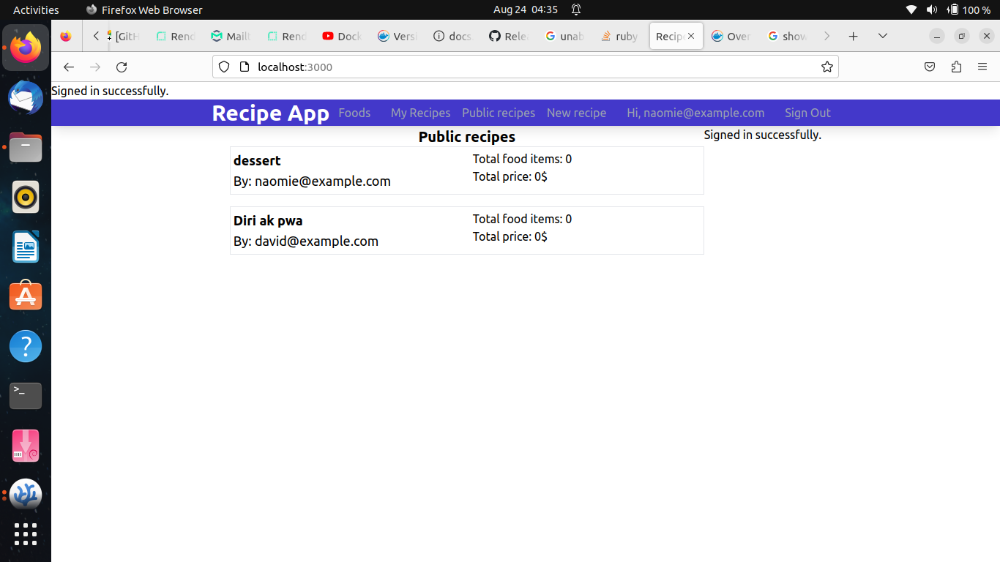

# Recipe app

The Recipe app keeps track of all your recipes, ingredients, and inventory. This allows you to store ingredients, keep track of what you have, create recipes, and create a shopping list based on what you have and what is missing in the recipe. Also, since sharing recipes is an important part of cooking, the app allows you to make them open to everyone so everyone can access them.

## Screencast

## Screenshot

## Live demo
[Live demo](https://my-rails-recipe-1eb027f6e2ea.herokuapp.com/users/sign_in)

## Built With

- Ruby on Rails
- Ruby
- TailwindCSS
- HTML & CSS
- JavaScript
- Git
- Docker
- Docker-compose
- Rubocop
- Rspec
- OOP

## Getting Started

### Choice A: run without Docker

To get a local copy up and running follow these simple example steps.

- copy this link `https://github.com/david-lafontant/recipe-app.git`.
- get the directory that you want to clone the repository.
- open the terminal in this directory.
- run `git clone https://github.com/david-lafontant/recipe-app.git`.
- go to the repository folder in your command prompt, run `cd recipe-app`.
- run `bundle install`.
- run `npm install`
- Follow the instruction in the database configuration file : path `config\database.yml` and/or create database in your postgresql called `recipe_app_development` (this will depend on your configuration)
- run `rails db:reset` then `rails db:migrate`
- To run the test run `rspec` in your command prompt.
- To run the rails server run  `rails s` in your command prompt.

### Run with Docker
- Instal [Docker](https://docs.docker.com/engine/install/) and [docker-compose](https://docs.docker.com/compose/install/) on your computer
- copy this link `https://github.com/david-lafontant/recipe-app.git`.
- get the directory that you want to clone the repository.
- open the terminal in this directory.
- run `git clone https://github.com/david-lafontant/recipe-app.git`.
- go to the repository folder in your command prompt, run `cd recipe-app`.
- run `docker built --tag recipe-app .`
- run `sudo docker-compose up`

## Author

👤 **David Lafontant**

- GitHub: [@githubhandle](https://github.com/david-lafontant)
- Twitter: [@twitterhandle](https://twitter.com/manikatex)
- LinkedIn: [LinkedIn](https://www.linkedin.com/in/david-lafontant/)

## 🤝 Contributing

Contributions, issues, and feature requests are welcome!

Feel free to check the [issues page](../../issues/).

## Show your support

Give a ⭐️ if you like this project!

## Acknowledgments

- Microverse

## 📝 License

This project is [MIT](./MIT.md) licensed.

docker built --tag recipe-app .
docker run -p 3000:3000 recipe-app
